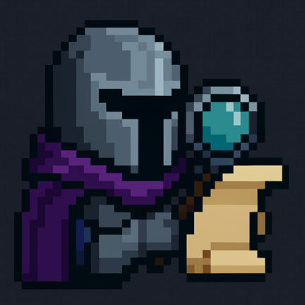

# Orna Assistant

  
  
  **A modern assistant app for Orna RPG players**
  
  
  
  
  

## 📱 Overview

Orna Assistant is an Android accessibility service app that enhances your Orna RPG gameplay experience by providing real-time overlays, automatic tracking, and helpful information while you play.

## ✨ Features

### 🏰 Dungeon Tracking
- Automatically tracks dungeon visits with detailed statistics
- Records orns, gold, experience, and floor progression
- Supports all dungeon modes (Normal, Hard, Boss, Endless)
- Tracks godforge drops
- Maintains history of all dungeon runs

### 🚢 Wayvessel Sessions
- Monitors wayvessel activation and session statistics
- Tracks cumulative rewards across multiple dungeons
- Cooldown notifications when wayvessel becomes available
- Session-based dungeon grouping

### 🎯 Real-time Overlays
- **Session Overlay**: Shows current dungeon/wayvessel statistics
- **Party Invites Overlay**: Displays party invites with dungeon cooldown information
- **Item Assessment Overlay**: Automatically assesses items using orna.guide API
- Draggable and customizable overlay positions
- Adjustable transparency settings

### 📊 Statistics & History
- Weekly dungeon visit charts
- Detailed statistics (completion rate, favorite mode, average duration)
- Full dungeon history with filtering options
- Export functionality for data analysis

### 🔔 Smart Notifications
- Wayvessel cooldown reminders
- Customizable notification sounds
- Background service notifications

## 🚀 Installation

1. Download the latest APK from the [Releases](https://github.com/yourusername/ornaassistant/releases) page
2. Enable "Install from Unknown Sources" in your Android settings
3. Install the APK
4. Grant required permissions when prompted

### Required Permissions Setup

1. **Accessibility Permission**
   - Go to Settings → Accessibility
   - Find "Orna Assistant" in the list
   - Enable the service
   - Accept the disclosure dialog

2. **Overlay Permission**
   - The app will prompt for overlay permission
   - Or go to Settings → Apps → Orna Assistant → Advanced → Display over other apps
   - Enable the permission

## 🎮 Usage

1. Launch Orna Assistant
2. Grant all required permissions
3. Start Orna RPG
4. The app will automatically detect game screens and show relevant overlays

### Overlay Controls
- **Tap** to dismiss an overlay
- **Long press and drag** to reposition
- Overlay positions are saved automatically

### Customization
- Access settings through the gear icon
- Toggle individual overlays on/off
- Adjust overlay transparency
- Configure notifications
